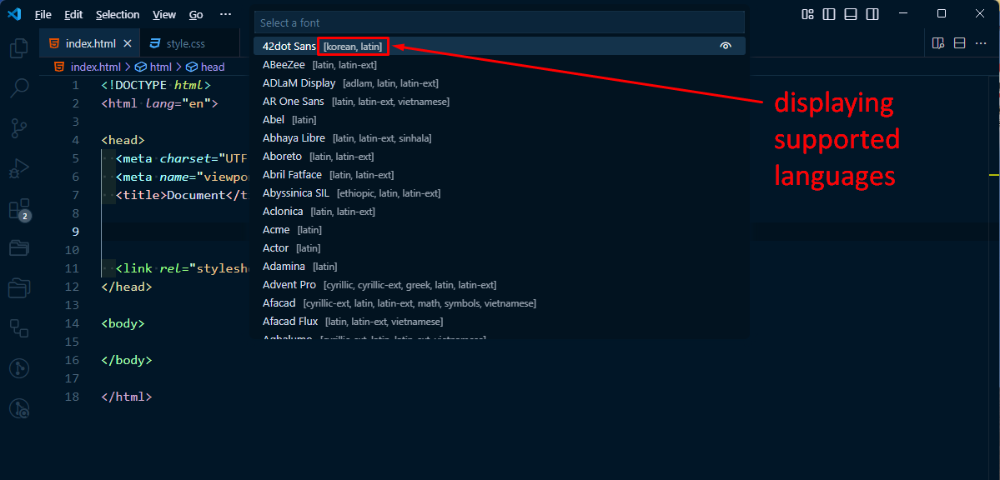
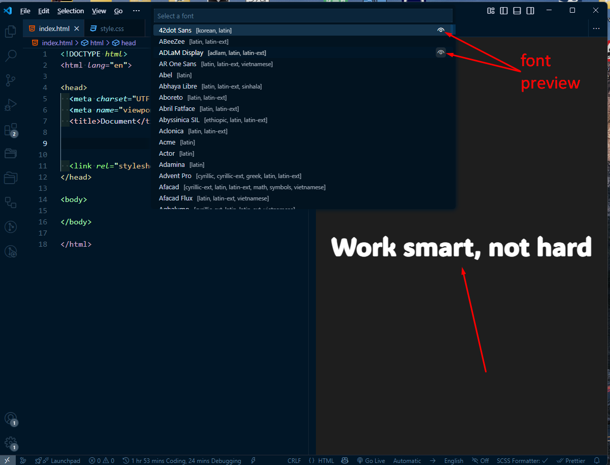

# Google Fonts extension for Visual Studio code!

This extension allows you to browse the list of Google Fonts and insert either HTML <link href=".."/> or CSS @import url(...) !

When you add a font using the link tag, preconnect is automatically added

```html
<link rel="preconnect" href="https://fonts.googleapis.com" />
<link rel="preconnect" href="https://fonts.gstatic. com" crossorigin />
```

When you select a font family, the languages supported by this font (Latin, Cyrillic, individual languages) are displayed next to the name


When selecting a font, you can see its preview by clicking on the icon on the right side


You can specify the desired font weight from the available options in the drop-down list

## Features

### Insert &lt;link href=".."&gt; for the selected Google Font !

You can easily browse Google Fonts and create a <link href> for it !


### Insert @import operator in CSS for the selected Google Font!

You can easily browse Google Fonts and create an @import statement for it!


