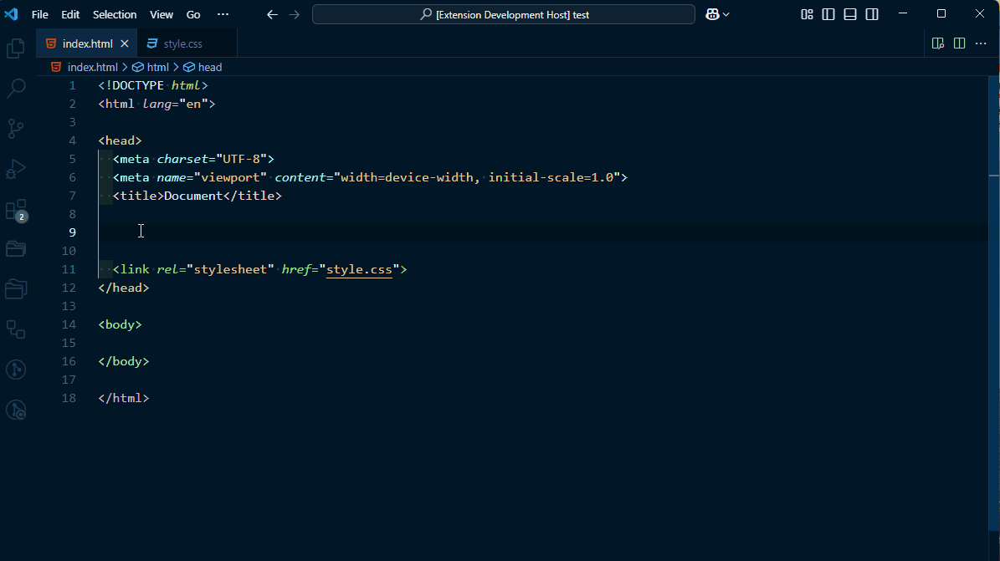
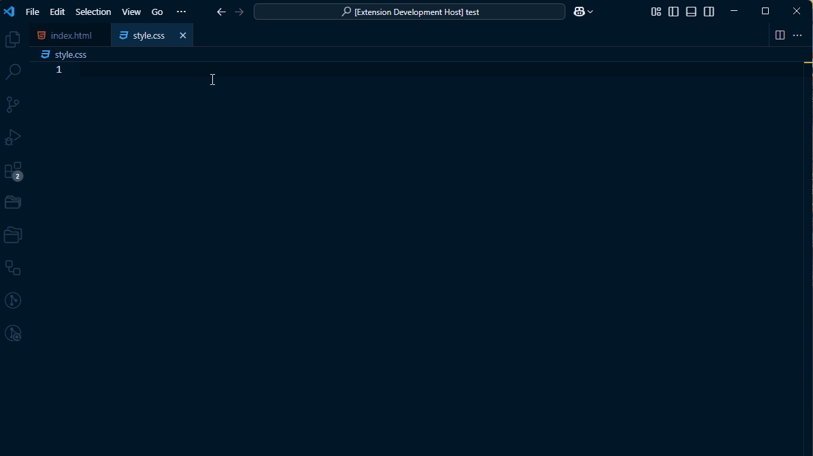

# Google Fonts extension for Visual Studio Code !

This extension allows you to browse the Google Fonts list and insert into your code either a HTML <link href=".."/> or a CSS @import url(...) !

You can specify the desired font weight from the available options in the drop-down list

## Features

### Inserting a &lt;link href=".."&gt; for a chosen Google Font !

You can easily browse Google Fonts and create a <link href> for it !

### Inserting a @import statement in CSS for a chosen Google Font !

You can easily brows Google Fonts and create an @import statement for it !

